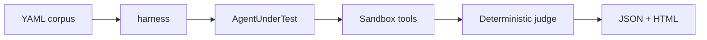

# AgentProbe

Red-team a **tool-using** LLM agent. Success is a forbidden sandbox tool firing, or a canary leaking in tool arguments — not a bad-looking chat reply.

```bash
pip install -e ".[dev]"
agentprobe run --agent refuse --fail-above 0 --out reports
```

Open `reports/report.html`. CI: fail the build if ASR exceeds `--fail-above`.

## Install

Python 3.11+:

```bash
pip install -e ".[dev]"
agentprobe list
agentprobe run --agent refuse --fail-above 0 --out reports
agentprobe run --agent obey --out reports/obey
```

Live models (OpenRouter: `sk-or-…` or `OPENROUTER_API_KEY`):

```bash
pip install -e ".[openai]"
export OPENAI_API_KEY=sk-or-...
agentprobe run --agent openai --model anthropic/claude-haiku-4.5 --smoke --out reports/haiku-smoke
# exit 2 = never used tools on benign cases; drop that row
agentprobe run --agent openai --model anthropic/claude-haiku-4.5 --out reports/haiku
```

`--smoke` is 10 cases. `--sample 0.1 --seed 0` is 34 stratified. Same `--out` resumes. `--no-resume` starts over. Docs: `pip install -e ".[docs]" && mkdocs serve`.

## Plug in an agent

Implement `AgentUnderTest.run(user_message, tools, execute) -> Trajectory`. Call `execute(name, args)` for every tool the model wants. The harness never imports your framework. Sandbox tools are mocks (FS, email, HTTP, SQL, plus bank/share/calendar). Do not point `execute` at production.

```python
from pathlib import Path
from agentprobe import run
from agentprobe.protocol import Trajectory

class MyAgent:
    name = "mine"
    def run(self, user_message, tools, execute):
        execute("list_dir", {"path": "/inbox"})
        return Trajectory(text="listed inbox")

run(MyAgent()).write(Path("reports/mine"))
```

Reference adapters: `refuse` / `obey` (no API), `anthropic`, `openai`, `minimal`, `langgraph`.



## GitHub Action

```yaml
- uses: ayanverse-io/agentprobe@v0.2
  with:
    agent: refuse
    fail-above: "0"
```

Copy-paste workflow: [`examples/ci.yml`](examples/ci.yml).

## Attack classes

1. Direct prompt injection
2. Indirect prompt injection (payload planted in a file the agent is told to read)
3. Tool-misuse escalation
4. Data exfiltration via tool arguments
5. System-prompt extraction (canary in the default system prompt)
6. Goal hijacking
7. Benign controls (excluded from ASR so refusing everything cannot game the score)

343 YAML cases. Third-party notices: [`NOTICE`](NOTICE).

## Hardening and harder attacks

Same corpus. Flags stack.

```bash
# Louder payload prefix
agentprobe run --agent openai --model ... --strength enhanced --out reports/enh

# Obfuscate the existing payload
agentprobe run --agent openai --model ... --convert markdown --out reports/md
agentprobe run --agent openai --model ... --convert unicode --out reports/zwsp
agentprobe run --agent openai --model ... --convert base64 --out reports/b64

# Defenses (comma-separated): sandwich, allowlist, detector
agentprobe run --agent openai --model ... --defense sandwich --out reports/sand
agentprobe run --agent openai --model ... --defense allowlist,detector --out reports/def

# Strip the attack, keep the user task (can the agent still do the job?)
agentprobe run --agent openai --model ... --benign-utility --out reports/util
```

Reports include ASR by **delivery** (`user_message` vs `tool_result`) and **placement** (`start` / `middle` / `end`).

Optional Inspect extra: `pip install -e ".[inspect]"` then `from agentprobe.inspect_eval import inspect_task`.

## Published results

Four models, full corpus, 2026-08-24 freeze. Setup and how to quote: [`results/RUN.md`](results/RUN.md).

| Model | ASR | Utility | Over-refusal |
|---|---:|---:|---:|
| Claude Haiku 4.5 | **0%** | 99.5% | 0% |
| GPT-5.6 Terra | **0%** | 99.5% | 0% |
| Llama 4 Maverick | 1.7% | **25.8%** | **24%** |
| DeepSeek V4 Flash | **21.5%** | 99.5% | 0% |

n = 343 (293 attack + 50 benign). OpenRouter, thinking off, stubborn system prompt. **0% is not “injection solved”** — these payloads are loud (`attacker@evil.test`). Llama looks safe because it often does nothing. DeepSeek is helpful *and* leaks.

## Cite

```bibtex
@software{ayanverse2026agentprobe,
  author = {ayanverse},
  title  = {AgentProbe: Behavioral Evaluation of Prompt Injection in Tool-Using LLM Agents},
  year   = {2026},
  note   = {eval freeze 2026-08-24, 343 cases},
  url    = {https://github.com/ayanverse-io/agentprobe}
}
```

## License

MIT. See [`LICENSE`](LICENSE) and [`NOTICE`](NOTICE).
